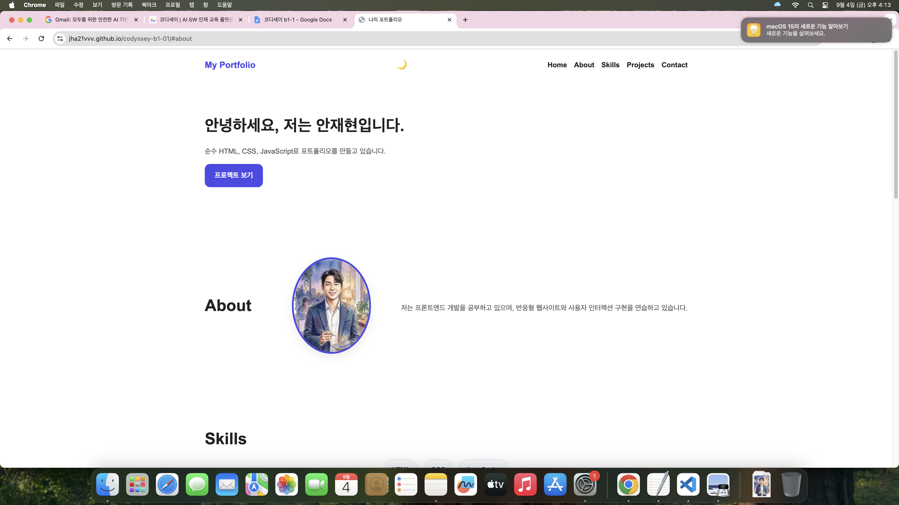
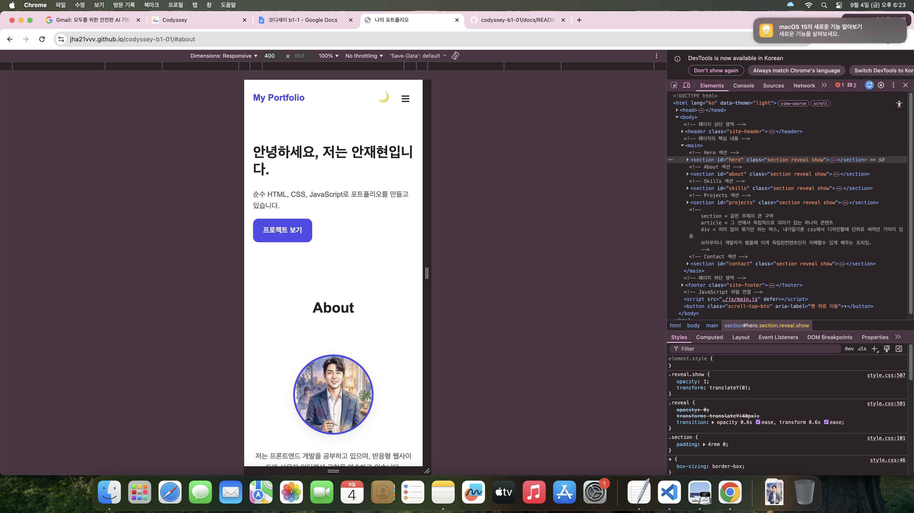
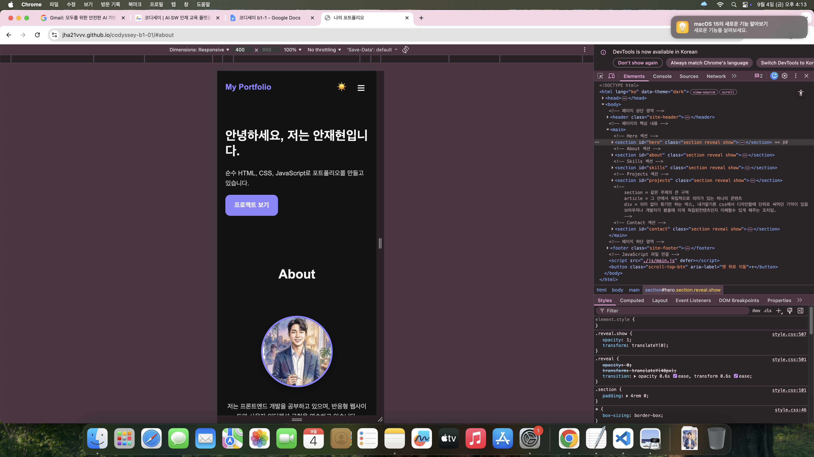

# 포트폴리오 프로젝트 체크리스트
### 1.프로젝트 소개
- 순수 HTML, CSS, JavaScript만 사용해 제작한 반응형 포트폴리오 웹사이트
- 사용자 이벤트 처리, DOM 조작, 다크모드, 폼 유효성 검사, GitHub API 연동을 구현

### 2. 배포 링크 와 깃링크
https://jha21vvv.github.io/codyssey-b1-01/
https://github.com/jha21vvv/codyssey-b1-01

### 3. 기본 구조

```bash 
docs/
├── index.html
├── css/
│   └── style.css
├── js/
│   └── main.js
├── images/
└── README.md
```

### 4. 사용 기술
- HTML5
- CSS3
- JavaScript (ES6+)
- GitHub Pages
- GitHub REST API

### 5. 주요 기능
- 반응형 레이아웃
- 햄버거 메뉴
- 부드러운 스크롤
- 다크모드 토글 및 localStorage 저장
- 스크롤 탑 버튼
- 네비게이션 스크롤 배경 변경
- 스크롤 애니메이션 (Intersection Observer)
- Contact 폼 유효성 검사
- GitHub API를 활용한 프로젝트 목록 렌더링
- 로딩 / 에러 / 빈 상태 UI 처리

### 6. 스크린샷




### 7. 페이지 구성
- Hero
- About
- Skills
- Projects
- Contact
- Footer

### 8.  반응형 기준
- Mobile First
- Tablet: 768px 이상
- Desktop: 1024px 이상

### 9. 기타 주요 사항
- 스크롤 탑 버튼 표시: 300px 이상 스크롤 시
- 네비게이션 배경 변경: 60px 이상 스크롤 시
- 스크롤 애니메이션 threshold: 0.2

### 10. GitHub API 연동
- 엔드포인트: https://api.github.com/users/{github-username}/repos
- fetch + async/await 사용
- 로딩, 성공, 에러, 빈 상태를 UI로 처리

### 11. 폼검증
- 이름, 이메일, 메시지 필수 입력
- 이메일 형식 정규식 검사
- 제출 시 기본 동작 방지
- 성공 메시지 표시

### 12. 체크리스트
- [O] index.html 만들기
- [O] css/style.css 연결
- [O] js/main.js defer 연결
- [O] images 폴더 만들기
- [O] Live Server 실행 확인

- [O] Header 만들기
- [O] Nav 만들기
- [O] Hero 섹션 만들기
- [O] About 섹션 만들기
- [O] Skills 섹션 만들기
- [O] Projects 섹션 만들기
- [O] Contact 섹션 만들기
- [O] Footer 만들기

- [O] CSS 변수 만들기
- [O] 모바일 퍼스트 작성
- [O] 768px 태블릿 대응
- [O] 1024px 데스크톱 대응
- [O] Nav Flexbox 적용
- [O] Projects Grid 적용

- [O] 햄버거 메뉴
- [O] 부드러운 스크롤
- [O] 스크롤 탑 버튼
- [O] 스크롤 시 nav 스타일 변경
- [O] 다크 모드 토글
- [O] localStorage 저장
- [O] 스크롤 애니메이션

- [O] 이름 검증
- [O] 이메일 검증
- [O] 메시지 검증
- [O] 에러 메시지 표시
- [O] 성공 메시지 표시

- [O] 로딩 상태 UI
- [O] 성공 상태 UI
- [O] 에러 상태 UI
- [O] 빈 상태 UI
- [O] 재시도 버튼 만들기

- [O] GitHub 저장소 업로드
- [O] GitHub Pages 배포
- [O] README 작성
- [O] 스크린샷 첨부


### 추가 게인적 정보 기록
# 1. 모바일 퍼스트란 점
 - @media (min-width: ...)로 기능/레이아웃을 추가
```bash 
.menu-toggle {
  display: block;
  background: none;
  border: none;
  font-size: 1.5rem;
  cursor: pointer;
  color: var(--color-text);
}

# 최소너비가 768px이상인, 즉 테블렛에선 토글이 안보인다는 내용
@media (min-width: 768px) {
  .menu-toggle {
    display: none;
  }
```
# 2. 주석 적는 방법
```bash 
# html주석
<!-- 주석 내용 -->
# CSS 주석
/* 주석 내용 */
# JavaScript
// 주석 내용

/* 
주석 내용
여러 줄 설명 가능
*/
```
시매틱 태그란? 이 부분이 어떤 역할인지 의미를 가진 태그 (ex) <header> : 페이지 윗부분
```bash 
<!DOCTYPE html>
<html lang="ko">
<head>
  <meta charset="UTF-8" />
  <meta name="viewport" content="width=device-width, initial-scale=1.0" />
  <title>나의 포트폴리오</title>

  <!-- CSS 연결 -->
  <!-- HTML에서 외부 파일을 연결 -->
  <link rel="stylesheet" href="./css/style.css" />
</head>
<body>
  <h1>포트폴리오 시작!</h1>
  <p>HTML, CSS, JavaScript 연결 테스트 중입니다.</p>

  <!-- JavaScript 연결 -->
  <!-- defer를 붙인이유: HTML을 먼저 읽고 그 다음 JS를 실행하게 하려고 -->
  <script src="./js/main.js" defer></script>
</body>
</html>
```
학습 과제 관련 질문
- HTML에서 시맨틱 태그를 왜 사용하는지 또한 본인이 어떤 기준으로 구조를 설계했는지 설명할 수 있다.
> 시맨틱 태그: 단순히 화면에 내용을 보여주는 것을 넘어 브라우저, 검색엔진, 스크린 리더(시각장애인용 도구)에게 "이 영역이 문서에서 무슨 역할을 하는지" 명확히 알려주기 위해 사용
> 주로 해당 부분이나 함수들의 기능을 기반으로 설계
> 필수적 요소부터 상세순서로 
- CSS에서 Flexbox와 Grid의 차이, 그리고 언제 각각을 선택해야 하는지 설명할 수 있다.
> 플랙스 박스는 공간의 변환에 따라 내부 요소들의 배치 변경, 세로에서 가로로
> 그리드는 일정 형태의 바둑판식 배열
- querySelector로 DOM을 선택하고, addEventListener로 이벤트를 연결하는 흐름을 설명할 수 있다.
> querySelector는 html의 div로 이름 정해놓은거 불러오는 방식
> addEventListener는 해당이 클릭되거나 그위에 마우스가 올려졌을때 등을 넣을수 있음
- 화살표 함수, 구조분해 할당, 배열 메서드(map/filter)가 왜 필요하고 어떻게 사용하는지 설명할 수 있다.
> 화살표 함수는 간단하고 디스 오류 문제가 없다.
> 디스 오류라 함은 해당 함수를 하는 주체가 누구냐의 문제인데 이게 생길 우려가 적어진다.
```bash
const 철수 = {
  이름: "철수",
  인사: function() {
    // 1초 뒤에 인사해라!
    setTimeout(function() {
      // 💥 여기서 문제 발생!
      console.log(`안녕 나는 ${this.이름}야!`);
    }, 1000);
  }
};

철수.인사();
```
```bash
const 철수 = {
  이름: "철수",
  인사: function() {
    // 화살표 함수로 변경!
    setTimeout(() => {
      console.log(`안녕 나는 ${this.이름}야!`);
    }, 1000);
  }
};

철수.인사();
```
> 구조할당 배당
```bash
// 현재 깃허브 코드 안쪽
<h3>${repo.name}</h3>
<p>${repo.description ?? '설명이 없습니다.'}</p>

// 택배 상자(repo)에서 필요한 알맹이만 쏙 꺼내기
const { name, description } = repo;

// 이제 'repo.' 없이 바로 씁니다.
<h3>${name}</h3>
<p>${description ?? '설명이 없습니다.'}</p>
```
>배열 메소드
```bash
const repoCards = repos.map((repo) => {
  return `
    <article class="project-card">
      <h3>${repo.name}</h3>
    </article>
  `;
});
```
- fetch와 async/await로 비동기 데이터를 가져오고, 로딩/성공/실패 상태를 UI로 어떻게 표현했는지 설명할 수 있다.
> 서버에서 데이터를 받아오는 동안 사용자가 "멈춘 건가?" 착각하지 않도록 로딩, 성공, 실패 3단계를 명확히 처리
```bash
const fetchGitHubRepos = async () => {
  try {
    // 1단계: 로딩 상태 (음식 시키고 기다리는 중)
    projectsContainer.textContent = '로딩 중...';

    // 인터넷으로 깃허브에 데이터 달라고 주문 넣기 (await: 올 때까지 기다려!)
    const response = await fetch('https://api.github.com/users/jha21vvv/repos');
    const repos = await response.json();

    // 2단계: 성공 상태 (음식 도착해서 먹는 중)
    projectsContainer.innerHTML = repoCards.join('');

  } catch (error) {
    // 3단계: 실패 상태 (가게가 문 닫았거나 배달 사고 났을 때)
    projectsContainer.innerHTML = `
      <p>프로젝트를 불러올 수 없습니다.</p>
      <button class="retry-btn">다시 시도</button>
    `;
  }
};
```
- "하나의 기능"을 만들기 위해 이벤트 → 상태 변경 → DOM 업데이트가 어떻게 연결되는지 설명할 수 있다. (React의 상태-렌더링 흐름의 기초)
```bash
// 1. 이벤트 (사용자가 스위치를 누름)
themeToggle.addEventListener('click', () => {

  const currentTheme = document.documentElement.getAttribute('data-theme');

  if (currentTheme === 'dark') {
    // 2. 상태 변경 (컴퓨터 메모리 안의 스위치 값을 'light'로 쓱 바꿈)
    document.documentElement.setAttribute('data-theme', 'light');
    localStorage.setItem('theme', 'light');

    // 3. DOM 업데이트 (변경된 스위치 값에 맞춰 눈에 보이는 화면 글자를 바꿈)
    themeToggle.textContent = '🌙';
    
  } else {
    // 2. 상태 변경 (컴퓨터 메모리 안의 스위치 값을 'dark'로 쓱 바꿈)
    document.documentElement.setAttribute('data-theme', 'dark');
    localStorage.setItem('theme', 'dark');

    // 3. DOM 업데이트 (화면 글자를 해(☀️)로 바꿈)
    themeToggle.textContent = '☀️';
  }
});
```
- 평가 질문 리스트
- 브라우저 창 크기를 줄였을 때 레이아웃이 모바일에 맞게 변경되는가?
> 완
- 테마 토글 버튼 클릭 시 다크/라이트 모드가 전환되고, 새로고침 후에도 유지되는가?
> 완
- 햄버거 메뉴, 스크롤 애니메이션, 맨 위로 가기 버튼 등이 정상 동작하는가?
> 완
- GitHub API에서 데이터를 불러와 화면에 표시되고, 로딩/에러/빈 상태가 구분되는가?
> 완
- 필수 입력값 누락, 이메일 형식 오류 시 즉각적인 피드백이 표시되는가?
> 완
- HTML, CSS, JavaScript가 각각의 파일로 분리되어 있고, 분리한 이유와 각 파일의 역할을 구분하여 답변할 수 있는가?
> 코드의 가독성을 높이고, 유지보수와 재사용을 쉽게 만들기 위함입니다. 구조가 바뀌어도 스타일이나 동작을 독립적으로 수정할 수 있
- header, nav, main, section, footer 등 시맨틱 태그를 사용했고, 어떤 기준으로 태그를 선택했는지 설명할 수 있는가?
> 기능에 따라 구분
- CSS 변수(:root)로 색상, 폰트 등을 정의했고, 변수로 관리하면 어떤 이점이 있는지 구체적으로 답변할 수 있는가?
> 메인 색상이나 폰트 규격이 바뀔 때 수십, 수백 줄의 코드를 찾지 않고 :root의 값 하나만 변경하면 전체 반영
- onclick 인라인 속성 대신 addEventListener를 사용한 이유를 두 방식의 차이를 비교하여 제시할 수 있는가?
>인라인 방식은 HTML 태그 안에 JS 코드가 섞여 구조와 동작의 경계가 흐려지고 코드가 난잡, 한개의 명령만 등록 가능
> addEventListener는 하나의 버튼 클릭에 대해 "통계 로그 전송", "팝업 닫기" 등 여러 독립적인 동작을 충돌 없이 동시에 등록
- 다크 모드, API 호출, 폼 유효성 검사 중 하나를 예시로 들어, "이벤트 → 상태 변경 → 화면 업데이트" 흐름이 코드에서 어떻게 이어지는지 따라가며 짚어줄 수 있는가?
```bash
[data-theme="dark"] {
  --color-bg: #121212;
  --color-text: #f5f5f5;
  --color-subtext: #cfcfcf;
  --color-primary: #8b82ff;
  --color-primary-dark: #6f66ff;
  --color-surface: #1e1e1e;
  --color-border: #333333;
  --color-shadow: rgba(0, 0, 0, 0.3);
}

생략

body {
  background-color: var(--color-bg);
  color: var(--color-text);
  transition: background-color 0.3s ease, color 0.3s ease;
}
```

- async/await와 try/catch를 사용하여 API 호출 성공과 실패를 어떻게 분기 처리했는지 코드 흐름을 따라 답변할 수 있는가?
> 완
- map, filter 등 배열 메서드를 활용하여 GitHub 데이터를 카드 UI로 변환하는 과정을 단계별로 정리할 수 있는가?
>완
- Flexbox와 Grid를 각각 어디에 적용했는지 확인하고 해당 상황에서 그 방식을 선택한 이유를 비교하여 설명할 수 있는가?
>플랙스 박스는 가로 또는 세로 한 방향(1차원)으로 자연스럽게 흐르는 레이아웃
> 그리드는 각 카드의 내용 길이(설명 텍스트 등)가 달라도 모든 카드가 동일한 너비와 균일한 높이를 유지하며 바둑판식으로 깔끔하게 정렬
- 상태(STATE) 객체를 따로 만들어서 관리한 이유는 무엇이며, 그냥 변수로 처리하면 안되는 지 설명할 수 있는가?
>완
- 반응형 디자인에서 "모바일 퍼스트"로 작성한 이유를 이야기할 수 있는가?
>완
